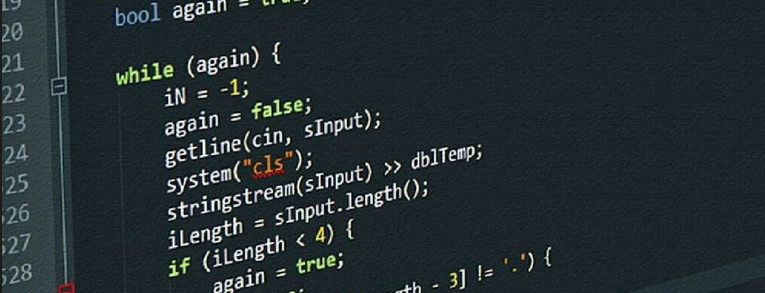
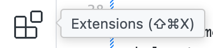
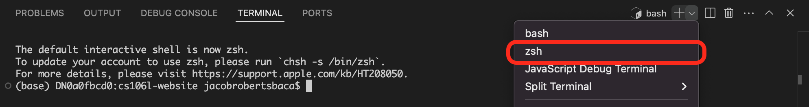
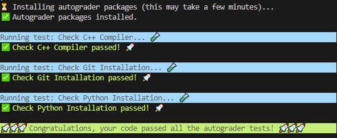

# 作业环境配置！

截止时间：4 月 17 日（周五）晚上 11:59

## 概述

欢迎来到 CS106L！本次作业将帮你配置好本学期剩余时间所需的开发环境，让之后每次作业的准备工作都简单顺畅。完成本作业后，你应该能够在 VSCode 中编译和运行 C++ 文件，并运行自动评分程序（autograder）——之后的每一次作业你都会用到它！

如果在配置过程中遇到任何问题，请在 [EdStem](https://edstem.org/us/courses/81492/discussion) 上联系我们，或者来参加我们的答疑时间（office hours）！

## 第 1 部分：安装 Python

### 第 1.1 部分：检查是否已安装 Python

CS106L 每次作业的自动评分程序都使用 Python。你必须安装 `3.8` 或更高版本的 Python。要检查你的 Python 版本，可以在终端中运行以下命令：

如果你使用的是 Linux 或 Mac：

```sh
python3 --version
```

如果你使用的是 Windows：

```sh
python --version
```

如果显示的版本是 `3.8` 或更高，那就没问题了，**你可以直接进入第 2 部分**。否则，请按照第 1.2 部分在你的机器上安装 Python。

### 第 1.2 部分：安装 Python（如果你尚未安装）

#### Mac 和 Windows

请在[这里](https://www.python.org/downloads/)下载最新版本的 Python 并运行安装程序。**注意：在 Windows 上，你必须在安装程序中勾选 `Add python.exe to PATH`**。安装完成后，按照**第 1.1 部分**中的步骤确认安装成功。

#### Linux

以下说明适用于基于 Debian 的发行版，例如 Ubuntu。已在 Ubuntu 20.04 LTS 上测试。

1. 运行以下命令更新 Ubuntu 软件包列表：

    ```sh
    sudo apt-get update
    ```

2. 安装 Python：

    ```sh
    sudo apt-get install python3 python3-venv
    ```

3. 重启终端，并运行以下命令确认安装成功：

    ```sh
    python3 --version
    ```

## 第 2 部分：配置 VSCode 和 C++ 编译器

本课程将使用 VSCode 编写 C++ 代码。下面是针对你的机器配置 VSCode 以及 GCC 编译器的说明。

### Mac

#### 第一步：安装 VSCode

打开[这个链接](https://code.visualstudio.com/docs/setup/mac)，下载 Mac 版 Visual Studio Code。按照该网页中 **Installation** 一节的说明进行操作。

在 VSCode 中，打开扩展标签页 </img>，搜索 **C/C++**。点击 **C/C++** 扩展，然后点击 **Install**。

最后，打开命令面板（<kbd>Cmd+Shift+P</kbd>），搜索 `Shell Command: Install 'code' command in PATH` 并选择它。这样你就可以在终端中运行 `code` 命令直接启动 VSCode。

**🥳 到这里，你的 Mac 上应该已经成功安装了 VSCode 👏**

#### 第二步：安装 C++ 编译器

1. 运行以下命令检查是否已安装 Homebrew：

    ```sh
    brew --version
    ```

   如果你看到类似这样的输出：

   ```sh
    brew --version
    Homebrew 4.2.21
   ```

   那么直接跳到第 3 步。如果你看到的是其他看起来不对劲的输出，请继续第 2 步！

2. 运行以下命令：

    ```sh
    /bin/bash -c "$(curl -fsSL https://raw.githubusercontent.com/Homebrew/install/HEAD/install.sh)"
    ```

    它会下载 Homebrew🍺——一个 Mac 上的包管理器。耶！

3. 运行以下命令：

    ```sh
    brew install gcc
    ```

    它会在你的机器上安装 GCC 编译器。

4. 记下 Homebrew 安装的 GCC 版本。大多数情况下是 `g++-14`。
    默认情况下，Mac 上的 `g++` 命令是内置 `clang` 编译器的别名。我们可以通过运行以下命令来修正：

    ```sh
    echo 'export PATH="$(brew --prefix)/bin:$PATH"\nalias g++="g++-14"' >> ~/.zshrc
    ```

    让 `g++` 指向我们刚刚安装的 GCC 版本。请把上面命令中的 `g++-14` 改成你实际安装的 GCC 版本。

5. 重启终端，并运行以下命令确认一切正常：

    ```sh
    g++ --version
    ```

> [!NOTE]
> 如果你在 VSCode 中运行代码，执行最后这条命令时可能会遇到问题。**请确保你在 VSCode 中使用的是 `zsh` 终端**，如下图所示：
> 
> 每当你需要为本课程运行 `g++` 时都需要这样做。**或者，你也可以把 VSCode 的默认终端改为 zsh**：按 <kbd>Cmd+Shift+P</kbd>，进入 **Terminal: Select Default Profile**，然后选择 **`zsh`**。

### Windows

#### 第一步：安装 VSCode

打开[这个链接](https://code.visualstudio.com/docs/setup/windows)，下载 Windows 版 Visual Studio Code。按照该网页中 **Installation** 一节的说明进行操作。

在 VSCode 中，打开扩展标签页 </img>，搜索 **C/C++**。点击 **C/C++** 扩展，然后点击 **Install**。

**🥳 到这里，你的 PC 上应该已经成功安装了 VSCode 👏**

#### 第二步：安装 C++ 编译器

1. 按照[这个链接](https://code.visualstudio.com/docs/cpp/config-mingw)中 **Installing the MinGW-w64 toolchain** 一节的说明进行操作。

2. 完整按照 **Installing the MinGW-w64 toolchain** 中的说明操作后，你现在应该可以运行以下命令来确认一切正常：

    ```sh
    g++ --version
    ```

### Linux

以下说明适用于基于 Debian 的发行版，例如 Ubuntu。已在 Ubuntu 20.04 LTS 上测试。

#### 第一步：安装 VSCode

打开[这个链接](https://code.visualstudio.com/docs/setup/linux)，下载 Linux 版 Visual Studio Code。按照该网页中 **Installation** 一节的说明进行操作。

在 VSCode 中，打开扩展标签页 </img>，搜索 **C/C++**。点击 **C/C++** 扩展，然后点击 **Install**。

最后，打开命令面板（<kbd>Ctrl+Shift+P</kbd>），搜索 `Shell Command: Install 'code' command in PATH` 并选择它。这样你就可以在终端中运行 `code` 命令直接启动 VSCode。

**🥳 到这里，你的 Linux 机器上应该已经成功安装了 VSCode 👏**

#### 第二步：安装 C++ 编译器

1. 在终端中运行以下命令更新 Ubuntu 软件包列表：

    ```sh
    sudo apt-get update
    ```

2. 接着安装 `g++` 编译器：

    ```sh
    sudo apt-get install g++-10
    ```

3. 默认情况下会使用系统自带版本的 `g++`。要切换到你刚安装的版本，可以像下面这样配置 Linux 使用 G++ 10 或你安装的更高版本：

    ```sh
    sudo update-alternatives --install /usr/bin/g++ g++ /usr/bin/g++-10 10
    ```

4. 重启终端，确认 GCC 已正确安装。你的 `g++` 版本必须是 10 或更高：

    ```sh
    g++ --version
    ```

## 第 3 部分：通过 Git 克隆课程代码！

Git 是一个流行的版本控制系统（VCS），我们会用它来分发作业的初始代码。运行以下命令确认你已安装 Git：

```sh
git --version
```

如果看到任何不对劲的输出，请[从这个页面下载并安装 Git](https://git-scm.com/downloads)！

### 下载初始代码

打开 VSCode，然后打开一个终端（按 <kbd>Ctrl+\`</kbd>，或在窗口顶部选择 **Terminal > New Terminal**），运行以下命令：

```sh
git clone https://github.com/cs106l/cs106l-assignments.git
```

它会把初始代码下载到 `cs106l-assignments` 文件夹中。

### 打开 VSCode 工作区

在完成本课程的作业时，我们建议你为当前正在做的那个作业文件夹单独打开一个 VSCode 工作区。所以，现在你已经有了 `cs106l-assignments` 文件夹，可以先 `cd`（切换目录）进入对应的文件夹：

```sh
cd cs106l-assignments/assignment0
```

这会把你的工作目录切换到 `assignment0`，然后你可以为这个文件夹打开一个专属的 VSCode 工作区：

```sh
code .
```

现在你应该已经准备就绪了！

### 获取作业更新

当我们更新已有作业或发布新作业时，会把更新推送到这个仓库。要获取新作业，请在 `cs106l-assignments` 目录下打开终端并运行：

```sh
git pull origin main
```

现在你就拥有最新的初始代码了！

# 第 4 部分：测试你的环境配置！

现在我们来编译你的第一个 C++ 文件并运行自动评分程序。要运行任何 C++ 代码，首先需要编译它。打开一个 VSCode 终端（同样，按 <kbd>Ctrl+\`</kbd>，或在窗口顶部选择 **Terminal > New Terminal**）。然后确认你位于 `assignment0/` 目录下，并运行：

```sh
g++ -std=c++23 main.cpp -o main
```

这条命令会把 C++ 文件 `main.cpp` **编译**成一个名为 `main` 的可执行文件，其中包含处理器可以直接执行的原始机器码。如果代码编译没有报错，你就可以运行：

```sh
./main
```

这会真正运行 `main.cpp` 中的 `main` 函数。它会执行你的代码，然后运行自动评分程序来检查你的安装是否正确。

> [!NOTE]
>
> ### Windows 用户注意
>
> 在 Windows 上，你可能需要使用以下命令编译代码
>
> ```sh
> g++ -static-libstdc++ -std=c++20 main.cpp -o main
> ```
>
> 才能看到输出。另外，生成的可执行文件可能叫 `main.exe`，这种情况下你需要这样运行代码：
>
> ```sh
> ./main.exe
> ```
>

> [!NOTE]
>
> ### Mac 用户注意
>
> 在编译这段代码时，你可能会因为缺少 `wchar.h`（或类似文件）而遇到编译错误。如果出现这种情况，你可能需要运行以下命令重新安装机器上的 Xcode 命令行工具：
>
> ```sh
> sudo rm -rf /Library/Developer/CommandLineTools
> sudo xcode-select --install
> ```
>
> 之后你应该就能正常编译了。

# 🚀 完成之后……

编译并运行后，如果你的自动评分程序输出如下：



那么你就完成了作业环境配置！耶！现在你可以开始 [作业 1](assignment1/README.md) 了！
