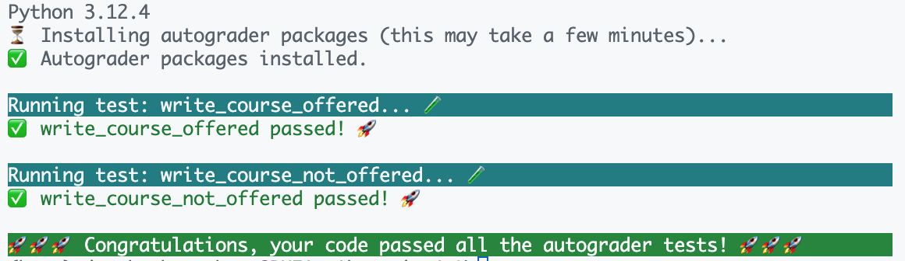

# 作业 1：EnrollmentNavigator（选课导航）

## 配置 C++ 环境

请找到并按照 [作业环境配置](../assignment-setup/README.md) 中的说明，为本次作业配置好 C++ 编译器和自动评分程序。

## 概述

又到了每学期的这个时候：该用 EnrollmentNavigator 了 🤗 耶！
每个人在斯坦福求学的某个时刻都会意识到：自己终究是要毕业的——于是选课就变成了一项策略性的任务：既要尽可能多地积累毕业所需的"经验值"，又要保证每晚能睡上 4 个小时以上！

在这个（希望很简短的）作业中，我们将使用来自 ExploreCourses API 的示例数据，找出 ExploreCourses 上哪些 CS 课程开课了，哪些没有开课！我们会用到流（stream），同时练习 C++ 中的初始化和引用。开始吧 ʕ•́ᴥ•̀ʔっ

你只需要关心两个文件：

* `main.cpp`：你所有的代码都写在这里 😀！
* `utils.cpp`：包含一些工具函数。你会用到这个文件中定义的函数，但除此之外不需要修改它。

## 运行你的代码

要运行代码，首先需要编译它。打开一个终端（如果你使用 VSCode，按 <kbd>Ctrl+\`</kbd>，或在顶部选择 **Terminal > New Terminal**）。然后确认你位于 `assignment1/` 目录下，并运行：

```sh
g++ -std=c++20 main.cpp -o main
```

如果代码编译没有任何编译错误，你就可以运行：

```sh
./main
```

这会真正运行 `main.cpp` 中的 `main` 函数。它会执行你的代码，然后运行自动评分程序来检查你的代码是否正确。

在按照下面的说明进行操作时，我们建议你时不时地编译并用自动评分程序测试一下，以确保你走在正确的方向上！

> [!NOTE]
> ### Windows 用户注意
> 在 Windows 上，你可能需要使用以下命令编译代码
> ```sh
> g++ -static-libstdc++ -std=c++20 main.cpp -o main
> ```
> 才能看到输出。另外，生成的可执行文件可能叫 `main.exe`，这种情况下你需要这样运行代码：
> ```sh
> ./main.exe
> ```

## 第 0 部分：阅读代码并补全 `Course` 结构体

1. 在本作业中，我们将用 `Course` 结构体在 C++ 中表示从 ExploreCourses 获取的记录。请查看 `main.cpp` 中（不完整的）`Course` 结构体定义，并补全各字段的定义。最终我们会用流来生成 `Course` 对象——还记得流处理的是什么类型吗？

2. 查看 `main.cpp` 中的 `main` 函数，特别留意 `courses` 是如何传入 `parse_csv`、`write_courses_offered` 和 `write_courses_not_offered` 的。思考这些函数在做什么。你需要修改函数定义中的什么吗？剧透一下：需要。

## 第 1 部分：`parse_csv`

看看 `courses.csv`，它是一个 CSV 文件，有三列：Title（课程名）、Number of Units（学分数）和 Quarter（学期）。实现 `parse_csv`，使其对 CSV 文件中的每一行，创建一个包含该行 Title、Number of Units 和 Quarter 的 `Course` 结构体。

你需要思考以下几点：
1. 你打算如何读取 `courses.csv`？嘿嘿嘿，也许用一个流 😏？
2. 你要如何获取文件中的每一行？

### 提示

1. 看看我们在 `utils.cpp` 中提供的 `split` 函数。它可能会派上用场！
    * 欢迎查看 `split` 的实现，有任何问题都可以问我们——由于它用的是 `stringstream`，你应该能理解它的原理。
2. 每一**行**就是一条记录！*这一点很重要，所以我们再说一遍 :>)*
3. 在 CSV 文件中（特别是 `courses.csv`），第一行通常是定义列名的行（列标题行）。这一行并不对应任何 `Course`，所以你需要想办法跳过它！

## 第 2 部分：`write_courses_offered`

好了，现在你已经有了一个填充好的 `courses` vector，`courses.csv` 文件中的所有记录都整整齐齐地存放在 `Course` 结构体中了！你只对开课的课程感兴趣，对吧？**如果一门课程的 Quarter 字段不是字符串 `"null"`，就认为它是开课的。** 在这个函数中，把所有 Quarter 字段不为 `"null"` 的课程写入 `"student_output/courses_offered.csv"`。

> [!IMPORTANT]
> 写入 CSV 文件时，请遵循以下格式：
> ```
> <Title>,<Number of Units>,<Quarter>
> ```
> 注意逗号之间**没有空格**！如果不遵循这个格式，自动评分程序会不高兴的！
>
> 另外，**请确保把列标题行写到输出的第一行**。也就是上一步中你在 `courses.csv` 中需要跳过的那一行！

调用 `write_courses_offered` 之后，我们期望所有开课的课程（也就是你写入输出文件的所有课程）都会从 `all_courses` vector 中移除。**这意味着在这个函数运行结束后，`all_courses` 中应当只包含未开课的课程！**

一种做法是用另一个 vector 记录开课的课程，然后把它们从 `all_courses` 中删除。和 Python 以及许多其他语言一样，在遍历一个数据结构的同时从中删除元素是个坏主意，所以你大概会想在把所有开课课程写入文件*之后*再进行删除。

## 第 3 部分：`write_courses_not_offered`

你对那些没开课的课程也很好奇……在 `write_courses_not_offered` 函数中，把 `unlisted_courses` 中的课程写入 `"student_output/courses_not_offered.csv"`。记住，由于你在上一步中已经删除了开课的课程，`unlisted_courses` 中自然只包含未开课的课程——算你走运。所以这一步应该和第 2 部分非常相似，只是更短、也*稍微*简单一点。

## 🚀 提交说明

编译并运行后，如果你的自动评分程序输出如下：



那么你就完成了这次作业！耶！

提交作业的方法：
1. 用你的斯坦福邮箱把 `main.cpp` 中的代码发送到 `cs106l-aut2627-staff@lists.stanford.edu`，邮件主题为 `CS106L Assignment 1 Submission`。

你需要提交的内容：

- `main.cpp`
