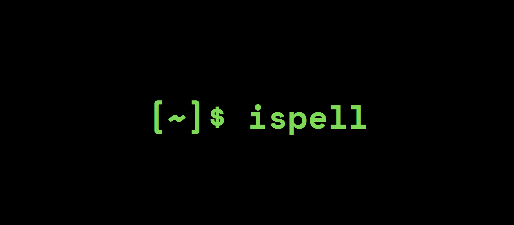
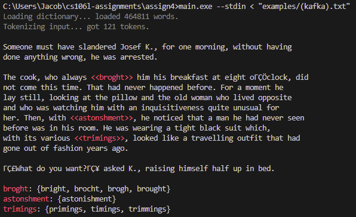
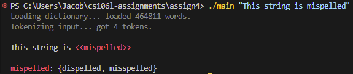

<p align="center">
  
</p>


# 作业 4：Ispell

截止时间：5 月 8 日（周五）晚上 11:59

## 概述

我们已经花了一些时间讨论 STL 的核心组成部分——容器、迭代器、仿函数和算法——以及驱动这一切的关键要素——模板，现在让我们把它们整合起来！
在本作业中，你将为 [Ispell](https://en.wikipedia.org/wiki/Ispell) 编写核心逻辑。Ispell 是一个老式的 Unix 风格拼写检查器，可以进行简单的拼写检查。为此，你需要编写一些使用 `<algorithm>` 头文件和全新 C++ ranges 库的代码。

你所有的代码都写在 `spellcheck.cpp` 中。完成后，你将得到一个如下所示的拼写检查器：

<p align="center">
  
</p>

> [!IMPORTANT]
> 这份作业说明看起来可能很长，但实际上你需要为本作业编写的代码并不多！我们加入了大量额外细节，（希望）能让实现过程更加直接。如果有任何让你困惑的地方，请告诉我们（欢迎通过 Ed、课堂或答疑时间联系我们）！我们还会在周二（05/05）的课上讲解 `tokenize`，帮助大家开始这次作业！

要下载本次作业的初始代码，请参阅课程作业仓库中的 [**入门指南（Getting Started）**](../README.md#getting-started) 说明。

## 运行你的代码

要运行代码，首先需要编译它。打开一个终端（如果你使用 VSCode，按 <kbd>Ctrl+\`</kbd>，或在顶部选择 **Terminal > New Terminal**）。然后确认你位于 `assignment4/` 目录下，并运行：

```sh
g++ -std=c++20 main.cpp spellcheck.cpp -o main
```

如果代码编译没有任何编译错误，你就可以运行：

```sh
./main
```

这会真正运行 `main.cpp` 中的 `main` 函数。

在按照下面的说明进行操作时，我们建议你时不时地编译并用自动评分程序测试一下，以确保你走在正确的方向上！

> [!NOTE]
>
> ### Windows 用户注意
>
> 在 Windows 上，你可能需要使用以下命令编译代码
>
> ```sh
> g++ -static-libstdc++ -std=c++20 main.cpp spellcheck.cpp -o main
> ```
>
> 才能看到输出。另外，生成的可执行文件可能叫 `main.exe`，这种情况下你需要这样运行代码：
>
> ```sh
> ./main.exe
> ```

## 构建 Ispell

经典的 Unix 程序 Ispell 的工作原理如下。首先，把一个包含所有常用英语单词的词典加载到内存中。如果一个单词在词典中找不到，它就是拼写错误的。每个拼写错误单词的建议是通过 [Damerau-Levenshtein 距离](https://en.wikipedia.org/wiki/Damerau%E2%80%93Levenshtein_distance)算法找到的，该算法大致告诉你需要进行多少次编辑（增加、删除或替换单个字母，或交换两个相邻字母）才能把一个单词变成另一个。如果拼写错误的单词与某个词典单词之间的 Damerau-Levenshtein 距离恰好为 1，那么该词典单词就会被加入建议列表。这里的思路是：人们拼错单词时，通常只差一个小改动（例如 "mispelled" 与 "misspelled"）。

在本作业中，我们已经为你提供了构建这个拼写检查器所需的全部基础设施，包括 Damerau-Levenshtein 函数的实现。你的任务是实现拼写检查算法的核心部分。具体来说，你将编写一个把输入字符串拆分成一组词元（token）的算法（`tokenize`），以及另一个在给定（已分词的）输入字符串和词典的情况下真正识别拼写错误单词的算法（`spellcheck`）。为了增加一点挑战（同时与上周的课程内容相关），这里有一个限制：你的代码中不能使用任何 for/while 循环。你必须完全使用 STL 来实现这些任务：`tokenize` 使用传统的 STL 算法，`spellcheck` 使用全新的 ranges 库。在这个过程中，你将接触到如何在 C++ 中使用算法和 lambda 函数来操作现代数据结构。

听起来可能很多，但别担心！这份说明会详细地带你逐一完成每个算法。

### `tokenize`

```cpp
struct Token { std::string content; size_t src_offset; };
using Corpus = std::set<Token>;
Corpus tokenize(std::string& input);
```

`tokenize` 方法接受一个输入字符串，并把它拆分成一组 `Token` 对象。看看我们在 `spellcheck.h` 中定义的 `Token` 结构体。一个 `Token` 表示一个较大文件中的一段内容：从概念上讲，它就是出现在一段较长文本中的一个单词；在代码中，它是出现在文件中下标为 `src_offset` 处的一个 `std::string`。我们的目标是把一个输入文件拆分成一组 `Token`，我们称之为 `Corpus`（语料库；`Corpus` 只是 `std::set<Token>` 的类型别名）。

这个问题的一个关键约束是：词元由空白字符和/或输入文件的边界包围。例如，短字符串 `"history will absolve me"` 由四个词元组成：

* `{ content: "history", src_offset: 0 }`
* `{ content: "will", src_offset: 8 }`
* `{ content: "absolve", src_offset: 13 }`
* `{ content: "me", src_offset: 21 }`

为了实现 `tokenize`，我们将使用 `std::transform` 等传统 STL 方法，不使用任何 for/while 循环。我们的总体策略是：

1. 找出所有指向空白字符的迭代器
2. 在相邻的空白字符之间生成词元
3. 去掉空词元

下面是你可以遵循的分步指南：

1. **第一步：找出所有指向空白字符的迭代器**
    如果我们能拿到字符串中所有指向空白字符的迭代器，那么大体上就可以把字符串中的词元看作任意两个空白字符之间的字符。我们几乎就是想多次调用 `find_if` 来收集所有指向空白字符的迭代器。幸运的是，我们已经为你提供了一个正好能做这件事的方法：`find_all`。

    > 📄 [**`find_all`**](./utils.cpp)
    > ```cpp
    > template <typename Iterator, typename UnaryPred>
    > std::vector<Iterator> find_all(Iterator begin, Iterator end, UnaryPred pred);
    > ```
    >
    > 返回一个 vector，包含 `begin` 与 `end` 之间所有元素满足一元谓词 `pred` 的迭代器。**这个 vector 还包含边界迭代器 `begin` 和 `end`**。换句话说，如果 `it` 是返回的 vector 中的一个迭代器，那么 `pred(*it)` 成立，或者 `it == begin`，或者 `it == end`。vector 中的迭代器保证是有序的。

    我们可以对 `source` 字符串调用 `find_all`，并传入一个检查字符是否为空白字符的一元谓词，从而得到所有指向空白字符的迭代器组成的 vector。好在 C++ 内置了这样一个函数：它叫 `isspace`。

    > 📄 [**`std::isspace`**](https://en.cppreference.com/w/c/string/byte)
    >
    > 注意：把这个函数作为谓词传入时，必须写成 `std::isspace`[^1]。
    >
    > ```
    > int std::isspace(int ch);
    > ```

[^1]: 使用 `std::isspace` 时，这个函数实际上有不止一个版本。

      ```cpp
      int isspace(int ch);                          // 定义在头文件 <cctype> 和 <ctype.h> 中

      template <class CharT>
      bool isspace(CharT ch, const locale& loc);    // 定义在头文件 <locale> 中
      ```

      严格来说，第一个版本既[作为 `namespace std` 的一部分](https://en.cppreference.com/w/cpp/header/cctype)被定义，也[作为从 C 继承而来的自由函数](https://en.cppreference.com/w/c/string/byte)被定义（不属于任何特定命名空间）。第二个版本属于 `std`，定义在 `<locale>` 头文件中。单独写 `isspace` 指的是 C 版本，而 `std::isspace` 同时指代上面两个函数，因此编译器很难推断出 `UnaryPred` 类型参数。

      有时你会看到有人写 `::isspace`：这只是告诉 C++ 在*全局命名空间*（而不是 `std` 内部）中查找 `isspace`，效果是一样的。

2. **第二步：在相邻的空白字符之间生成词元**
    现在我们已经有了所有指向空白字符的迭代器，可以把词元看作任意两个相邻的空白字符迭代器之间的字符范围。要理解为什么，请看这张示意图：

    ```
    "history will absolve me"
     ▲      ▲    ▲       ▲  ▲
     ├──────┼────┼───────┼──┤
     │  t1  │ t2 │   t3  │t4│
    ```

    箭头表示 `find_all` 返回的迭代器，可以看到，词元就是任意两个箭头之间的字符。不用担心迭代器是否真的指向空白字符（你不需要操心"修剪"词元）——`Token` 有一个接受一对迭代器的构造函数，它会自动处理边缘处空白字符的修剪。

    > 📄 [**`Token`**](./spellcheck.cpp)
    > ```cpp
    > template <typename It>
    > Token(std::string& source, It begin, It end);
    > ```
    >
    > 给定一个 `source` 字符串和一对标识 `source` 中某个词元范围的迭代器 `begin` 和 `end`，构造一个 `token`。会自动修剪词元边缘多余的空白字符和标点符号。

    我们需要以某种方式对每一对相邻的迭代器调用这个构造函数。为此，我们将使用 [`std::transform` 的重载 (3)](https://en.cppreference.com/w/cpp/algorithm/transform)。

    > 📄 [**`std::transform`**](https://en.cppreference.com/w/cpp/algorithm/transform)
    > ```cpp
    > template <class InputIt1, class InputIt2, class OutputIt, class BinaryOp>
    > OutputIt std::transform(InputIt1 first1, InputIt1 last1, InputIt2 first2,
    >                         OutputIt d_first, BinaryOp binary_op);
    > ```
    >
    > 给定两个大小相同的范围，一个从 `first1` 开始，另一个从 `first2` 开始（第一个范围的结束迭代器为 `last1`），对这两个范围中的每一对迭代器应用二元函数 `binary_op`（例如 `binary_op(first1, first2)`、`binary_op(first1 + 1, first2 + 1)` 等），并把结果存入从 `d_first` 开始的（大小相同的）输出范围。

    对于 `binary_op`，我们可以提供一个 lambda 函数，它接受两个 `std::string::iterator`（`it1` 和 `it2`；正如课上讨论的，你可以选择为这个 lambda 使用 `auto` 参数），并使用前面提到的 `Token { source, it1, it2 }` 构造函数来构造 `Token`。注意我们必须把 `source` 传给这个构造函数，所以你需要在创建的 lambda 函数中捕获它！**你必须按引用捕获 `source`，否则你的代码将无法运行！**

    > **‼️⚠️📢🚨 警告 🚨📢⚠️‼️**
    > 再重复一遍上面那部分，因为以往的同学在这里遇到过麻烦。**你必须在 lambda 函数中按引用捕获 `source`**，`Token` 构造函数才能正常工作。如果你不记得怎么做，请复习我们关于 lambda 函数捕获语法的课程幻灯片。

    对于输出范围（`d_first`），我们首先创建一个 `std::set<Token>` 来存放找到的词元。假设我们把这个集合叫做 `tokens`。然后，我们可以创建一个 [`std::inserter(tokens, tokens.end())`](https://en.cppreference.com/w/cpp/iterator/inserter) 来存放生成的词元。

    > 📄 [**`std::inserter`**](https://en.cppreference.com/w/cpp/iterator/inserter)
    > ```cpp
    > template <class Container>
    > std::insert_iterator<Container> inserter(Container& c, typename Container::iterator i);
    > ```
    >
    > 一个输出迭代器，它会把写入它的任何值插入到容器 `c` 的位置 `i`（`i` 是该容器的迭代器类型）。返回值是一个 [`std::insert_iterator<Container>`](https://en.cppreference.com/w/cpp/iterator/insert_iterator)，可以作为输出范围传给其他 STL 算法（例如 `std::transform`）。
    >
    > 注意，`std::inserter` 返回的迭代器和我们见过的其他迭代器类型有点不同，但它仍然是一个输出迭代器！其他算法可以对它解引用并写入，而它在内部会把元素插入到底层容器中。

    对于输入范围（`first1`、`last1` 和 `first2`），我们在选择迭代器时需要动点脑筋。我们必须这样选择迭代器：使得 `binary_op(first1, first2)` 构造容器中的第一个词元，`binary_op(first1 + 1, first2 + 1)` 构造容器中的第二个词元，以此类推。我们该如何设置这些参数，才能把 `binary_op` 应用到相邻的空白字符迭代器对上？记住，`tokens.begin()` 是容器的第一个迭代器，`tokens.begin() + 1` 是第二个迭代器，以此类推。**提示：没有任何规定禁止 `first1` 给出的范围与 `first2` 给出的范围相互重叠！**

3. **第三步：去掉空词元**
    到目前为止我们生成的一些词元会是空的（例如，如果字符串中有多个连续的空白字符会怎样）。我们需要移除这些词元。幸运的是，有一个 [`std::erase_if` 函数](https://en.cppreference.com/w/cpp/container/set/erase_if)可以从 `std::set` 中移除满足某个条件的元素。

    > 📄 [**`std::erase_if`**](https://en.cppreference.com/w/cpp/container/set/erase_if)
    > ```cpp
    > template <class Key, class Compare, class Alloc, class Pred>
    > std::set<Key, Compare, Alloc>::size_type erase_if (std::set<Key, Compare, Alloc>& c, Pred pred);
    > ```

    对于 `pred`，我们可以传入一个检查词元是否为空的 lambda 函数。例如，可以检查 `token.content.empty()`。

    最后，你就可以返回 `tokens` 了，其中包含了输入字符串中所有有效的词元。

完成这一步后，你的拼写检查器应该开始报告词元数量了。编译代码后，你可以运行：

```sh
./main "hello wrld"
```

来对字符串 `"hello wrld"` 进行拼写检查。它应该输出：

```
Loading dictionary... loaded 464811 words.
Tokenizing input... got 2 tokens.
```

你的 tokenize 方法以闪电般的速度对一部约五十万单词的英语词典以及输入字符串 `"hello wrld"` 完成了分词。不过，它还没有真正进行拼写检查：`"wrld"` 被报告为拼写正确。为了解决这个问题，我们需要实现 `spellcheck` 函数。

### `spellcheck`

```cpp
struct Misspelling { Token token; std::set<std::string> suggestions; };
using Dictionary = std::unordered_set<std::string>;
std::set<Misspelling> spellcheck(const Corpus& source, const Dictionary& dictionary);
```

`spellcheck` 方法接受一个已分词的 `Corpus`（即你的 `tokenize` 方法的输出）和一个 `Dictionary`（它只是一个表示所有有效英语单词的 `std::unordered_set<std::string>`），并返回一组 `Misspelling` 结构体。每个 `Misspelling` 结构体标识一个拼写错误的 `token`，以及一组可以替换该 `token` 以正确拼写的建议单词。

为了识别拼写错误，我们将运行以下算法。这一次，我们会练习使用 `std::ranges::views` 命名空间中新的 ranges/views 库：

1. 跳过已经拼写正确的单词。
2. 否则，使用 Damerau-Levenshtein 在词典中查找只差一次编辑的单词。
3. 丢弃没有任何建议的拼写错误。

下面是实现这个算法的分步指南：

1. **第一步：跳过已经拼写正确的单词。**
    如果一个单词出现在 `dictionary` 中，我们就知道它拼写正确：例如 `dictionary.contains("world")` 会返回 `true`，而 `dictionary.contains("wrld")` 会返回 `false`。我们的第一步是跳过 `source` 中已经拼写正确的单词。为此，我们可以使用 `std::ranges::views::filter` 视图。

    > 📄 [**`std::ranges::views::filter`**](https://en.cppreference.com/w/cpp/ranges/filter_view)
    > ```cpp
    > template <ranges::viewable_range R, class Pred>
    > constexpr ranges::view auto filter(R&& r, Pred&& pred);
    >
    > template <class Pred>
    > constexpr /* range adaptor closure */ filter(Pred&& pred);
    > ```
    >
    > `filter(r, pred)` 产生一个适配底层范围 `r` 的视图，在遍历结果视图时，只包含满足 `pred` 的元素。`filter(pred)` 创建一个*范围适配器（range adaptor）*，可以通过 `operator|` 链式地应用到一个范围上，如下所示。

    在搭建 `std::ranges::views` 管道时，我们把多个范围串联成一系列步骤。每一步都*适配*前一步，通过 lambda 函数惰性地应用某个操作（例如过滤掉或转换元素）。如果你看一下上面 `std::ranges::views::filter` 的定义，会发现有两种写法：

    ```cpp
    auto view = std::ranges::views::filter(source, /* A lambda function predicate */);

    /* ...等价于... */

    auto view = source | std::ranges::views::filter(/* A lambda function predicate */);
    ```

    第二种写法可以说更简洁，因为它允许我们用 `operator|` 在管道中串联多个步骤，而不必为每一步创建单独的变量。注意 `std::ranges::views::filter` 写起来有点繁琐，所以人们通常会像这样创建一个*命名空间别名*来简化：

    ```cpp
    namespace rv = std::ranges::views;
    auto view = source | rv::filter(/* A lambda function predicate */);
    ```

    自动评分程序两种写法都接受：使用命名空间别名的 `rv::filter`，或者 `std::ranges::views::filter`。

    这一步你的任务是把 `/* A lambda function predicate */` 替换成一个 lambda 函数，它接受一个 `Token`，如果该词元的内容拼写**错误**则返回 `true`（我们只关心拼写错误的单词）。为此，你需要在 lambda 函数内部引用 `dictionary`，因此必须捕获它。你应该按引用捕获还是按值捕获？

2. **第二步：使用 Damerau-Levenshtein 在词典中查找只差一次编辑的单词**
    此时，`view` 表示 `source` 中所有*拼写错误*的词元组成的视图。现在，我们将使用 `std::ranges::views::transform` 视图，把每个拼写错误的词元转换成对应的 `Misspelling` 对象（并在此过程中生成建议）。

    >  📄 [**`std::ranges::views::transform`**](https://en.cppreference.com/w/cpp/ranges/transform_view)
    > ```cpp
    > template <ranges::viewable_range R, class F>
    > constexpr ranges::view auto transform(R&& r, F&& func);
    >
    > template <class F>
    > constexpr /*range adaptor closure*/ transform(F&& func);
    > ```
    >
    > `transform(r, func)` 产生一个适配底层范围 `r` 的视图，在遍历结果视图时，`r` 中的每个元素 `e` 都会通过应用 `func(e)` 被转换成一个新元素。`transform(pred)` 创建一个*范围适配器*，可以通过 `operator|` 链式地应用到一个范围上。

    如果把这一步和上一步结合起来，我们的代码看起来大致是这样的：

    ```cpp
    namespace rv = std::ranges::views;
    auto view = source
        | rv::filter(/* A lambda function predicate */)
        | rv::transform(/* A lambda function taking a Token -> Misspelling */);
    ```
    <sup>注意：这只是一种做法：如果你选择使用 `transform(r, func)` 重载，或者不使用 `namespace rv` 别名，你的解法可能看起来会有所不同。</sup>

    `/* A lambda function taking a Token -> Misspelling */` 处应该填什么呢？我们应该把它替换成一个 lambda 函数，它接受一个 `Token` 对象，并产生一个包含 `token` 所有建议替代拼写的 `Misspelling` 对象。为了找出建议，我们将在 `dictionary` 中搜索所有与 `token.content` 的 Damerau-Levenshtein 距离恰好为 `1` 的单词。要计算 Damerau-Levenshtein 距离，你可以使用我们提供的 `levenshtein` 函数。

    > 📄 [**`levenshtein`**](./spellcheck.h)
    > ```cpp
    > size_t levenshtein(const std::string& a, const std::string& b);
    > ```
    >
    > 返回 `a` 与 `b` 之间的 Damerau-Levenshtein 距离。粗略地说，它表示需要对 `a` 进行多少次修改才能得到 `b`。实际上，这个函数实现的是 Damerau-Levenshtein 距离的一个高度优化版本，一旦计算出的距离在任何时候会大于 `1`，就会提前退出。

    注意，遍历 `dictionary` 并查找建议这件事应该对*每一个*拼写错误的单词都执行一次。**这意味着你需要在 `/* A lambda function taking a Token -> Misspelling */` 内部嵌套另一个 `std::ranges::views::filter` 调用。** 为了构造建议的 `std::set`，你需要使用 [`std::set` 构造函数的重载 (4)](https://en.cppreference.com/w/cpp/container/set/set)，把嵌套的建议单词视图物化（materialize）成一个集合，从而触发惰性求值。

    > 📄 [**`std::set`**](https://en.cppreference.com/w/cpp/ranges/transform_view)
    > ```cpp
    > template <class InputIt>
    > set(InputIt first, InputIt last, const Compare& comp = Compare(), const Allocator& alloc = Allocator());
    > ```
    >
    > 用两个迭代器 `first` 和 `last` 之间的元素范围创建一个 `set`。

    例如，下面的代码可以把一个视图物化成一个集合：

    ```cpp
    auto view = dictionary | rv::filter(/* A lambda function predicate */);
    std::set<std::string> suggestions(view.begin(), view.end());
    ```

    最后，要用一个 `token` 和一组 `suggestions` 创建 `Misspelling` 对象，我们可以使用统一初始化：

    ```cpp
    Misspelling { token, suggestions }
    ```

    这应该就是上面代码中 `/* A lambda function taking a Token -> Misspelling */` 这个 lambda 函数的返回值。

3. **第三步：丢弃没有任何建议的拼写错误。**
    此时，`view` 包含了所有拼写错误的单词及其建议：它是一个由 `Misspelling` 对象组成的集合上的视图。然而，其中一些 `Misspelling` 对象不会有任何建议。例如，乱码单词 `"adskadnfknfs"` 显然拼写错误，但英语词典中没有任何单词与它只差一次编辑。我们希望在返回之前，把这些没有建议的 Misspelling 从视图中移除。

    我们可以再一次对 `view` 应用 `std::ranges::views::filter`。你应该已经掌握了完成这一步所需的全部信息！过滤掉空的 Misspelling 之后，你需要把 `view` 物化成一个 `std::set<Misspelling>` 并返回，做法与上面第二步中描述的 `suggestions` 类似！

    > ⚠️ [**`std::ranges::to`**](https://en.cppreference.com/w/cpp/ranges/to)
    > 你可能还记得，我们在课上用 `std::ranges::to` 把一个 `char` 视图物化成了 `std::string`：
    > ```cpp
    > auto v = s | rv::filter(isalpha)
    >            | /* Some other steps */
    >            | std::ranges::to<std::string>();
    > ```
    > 你可能会想在这里用 `std::ranges::to<std::set<Misspelling>>()` 做类似的事情。这是个好主意！但 `std::ranges::to` 方法直到 C++23 才被引入。取决于你使用的编译器版本，这段代码可能能编译，也可能不能！为了保险起见，也为了确保我们在自己这边用自动评分程序运行时你的代码能够编译，请使用接受迭代器的 `std::set<Misspelling>` 构造函数。**总的来说，本作业请只使用 C++20 及以前的 C++ 特性。**

如果到目前为止你都正确实现了，你应该已经拥有一个功能完整的拼写检查器了！要测试一下，试着重新编译并运行：

```sh
./main "This string is mispelled"
```

你应该会看到类似这样的输出：

<p align="center">
  
</p>

你也可以对提供的某个示例进行拼写检查：

```sh
./main --stdin < "examples/(marquez).txt"
```

> [!NOTE]
> **PowerShell 用户：**
> 如果你使用的是 Microsoft PowerShell（Windows），对示例进行拼写检查的语法会有些不同：
> ```sh
> Get-Content "examples/(marquez).txt" | ./main --stdin
> ```

> [!NOTE]
> 我们鼓励你多玩玩这个拼写检查程序，看看能发现哪些有趣的行为。下面是你可以尝试的全部选项：
>
> ```
> ./main [--dict dict_path] [--stdin] [--unstyled] [--profile] text
>
> --dict dict_path  设置词典的位置。默认为 words.txt
> --stdin           从标准输入读取。你可以用它把文件内容通过管道传入
> --unstyled        输出时不添加任何颜色！
> --profile         对代码进行性能分析，输出分词/拼写检查各花了多长时间
> text              你想要拼写检查的文本（如果不使用 stdin）
> ```
>
> 如果你想挑战一下自己，试试用 `--profile` 选项运行你的代码。我们的拼写检查算法尽管使用的是简单的暴力方法——遍历整个约五十万单词的词典——运行速度仍然相当快！欢迎研究一下有哪些方法可以提升这个算法的性能（同时保持输出正确）！这完全是可选的，但我们很乐意看到你的成果。


## 🚀 提交说明

要全面测试你的拼写检查器，请重新编译并运行自动评分程序：

```sh
./main
```

如果你通过了所有测试，就可以提交了！提交作业的方法：
1. 请填写[这个链接](https://forms.gle/AMq7kvVKprKmBafKA)中的反馈表。
2. 在 [Paperless](https://paperless.stanford.edu) 上提交你的作业！

你需要提交的内容：

* `spellcheck.cpp`

在截止日期之前，你可以重复提交任意多次。
